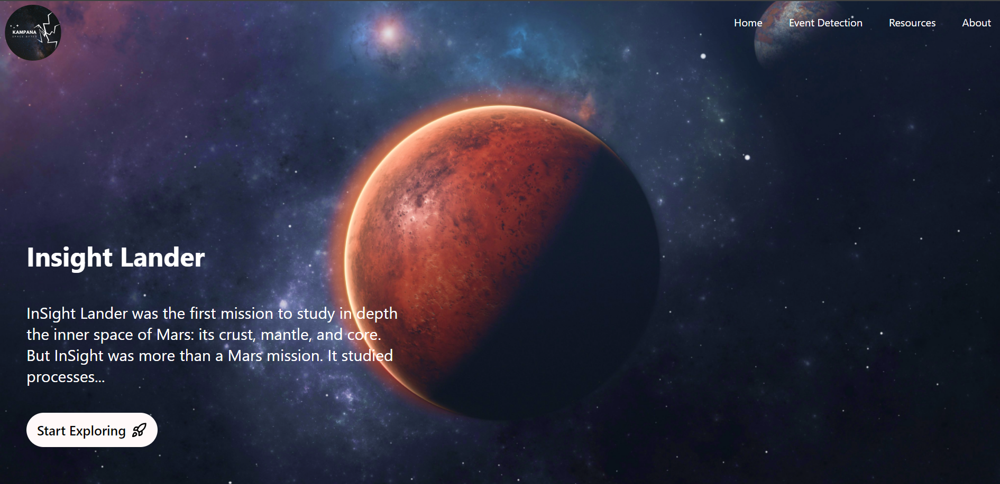

Kampana: Seismic Detection Across Solar System
==========================
Project Description [Visit](https://www.kampana.earth/)
-------------------

Kampana is a seismic detection project that aims to analyze and visualize seismic activity on the Moon and Mars. The website showcases line graphs of detected seismic events, provides downloadable resources, and describes the project's goals and methodologies. The application is built using React and TypeScript for the frontend, with Python libraried and algorithms for data processing. ( graph on works for moon )

[Visit](https://www.kampana.earth/)

Table of Contents
-----------------

*   [Getting Started](#getting-started)
*   [Frontend Structure](#frontend-structure)
*   [Server Setup](#server-setup)
*   [Model Directory Structure](#model-directory-structure)
*   [Python Algorithms](#python-algorithms)
*   [Features](#features)
*   [About the Team](#about-the-team)
*   [Resources](#resources)

### Getting Started

* * *

To run the frontend application:

1.  **Clone the Repository**:
    
    ```bash
    git clone https://github.com/ChiefBibek/Kampana.git
    cd Kampana
    ```
    
2.  **Navigate to the project directory**:
    
    ```bash
    
    cd Web/app
    ```
    
3.  **Install the dependencies**:
    
    ```bash
    npm install
    ```
    
4.  **Run the development server**:
    
    ```bash
    npm run dev
    ```
    

To run the backend server:

1.  **Navigate to the server directory**:
    
    ```bash
    npm install
    cd Web/server
    ```
    
2.  **Start the server**:
    
    ```bash
    npm run dev:server
    ```
    

    

Frontend Structure
------------------

The frontend consists of the following key pages:

*   **Home Page**: The landing page that introduces the project.
*   **Presentation Page**: A page for presentations and details about the project.
*   **Event Detection Page**: This page features a 3D model of Mars and the Moon. Users can select either celestial body to view associated seismic graphs.
*   **Resources Page**: Users can download project resources and datasets.
*   **About Page**: Information about the team and contributors to the project.

Model Directory Structure
-------------------------

The project includes a `model` directory structured as follows:

*   **model/**
    *   **dl/**: Contains models and related files.
        *   **failed\_approaches/**: Contains files for RNN and other failed models.
        *   **lunar/**: Contains STA/LTA algorithms to detect lunar seismic events.
        *   **mars/**: Contains STA/LTA algorithms for detecting seismic events on Mars.
        *   **catalog/**: Contains CSV and PNG files of detected seismic graphs.
        *   **sta\_lta/**: Contains the implementation of the STA/LTA algorithm.

Python Algorithms
-----------------

The algorithms for detecting seismic events are implemented in Python. To set up the Python environment, you can install the required packages listed in the `requirements.txt` file.

### Setting Up Python Environment

1.  Navigate to the Python project directory (if separate):
    
    ```bash
    
    cd model/dl
    ```
    
2.  Install the required packages:
    
    ```bash
    pip install -r requirements.txt
    ```
    

Features
--------

*   Visual representation of seismic events on a graph.
*   3D models of Mars and the Moon for an interactive experience.
*   Downloadable resources for further exploration and research.

About the Team
--------------

Kampana is developed by a dedicated team of enthusiasts interested in seismic research and space exploration. Our goal is to enhance understanding of seismic activities beyond Earth and provide valuable resources for researchers and enthusiasts alike.

Resources
---------

Below are the seismic data filtered my our model

*   [Download Lunar Seismic Data](https://drive.google.com/file/d/1PMAVwnl9HPXTEPdmvn2cwayGt-0T8qSq/view?usp=sharing) (link to resources)

*   [Download Mars Seismic Data](https://drive.google.com/file/d/1X0LrrbIlNlwl_ZQB_CjeI-tiX7WbxvEG/view) (link to resources)

* * *

For any issues or inquiries, please feel free to open an issue on the GitHub repository or contact the team.


